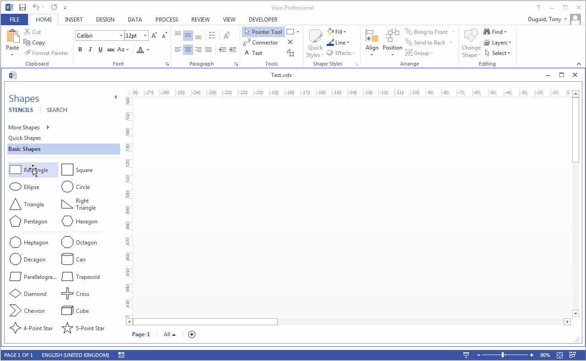

# Visio-DataFlow-R2

 

https://stackoverflow.com/questions/48081736/viso-vsto-shapeadded-event-not-firing-sometimes/48149438?noredirect=1#comment83283674_48149438

Created using [ScreenToGif](http://www.screentogif.com/)

<h1 align="left">
  
</h1>
