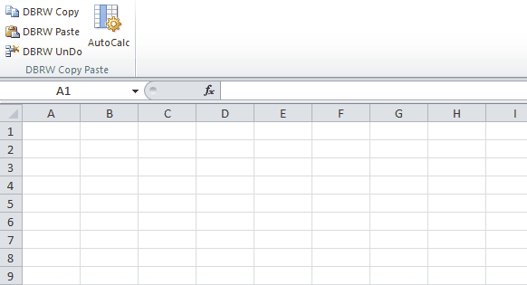

# Stack-Overflow-example

 

https://stackoverflow.com/questions/48211349/excel-ribbon-toggle-button-not-running-onaction-or-getpressed-callbacks/48218867#48218867

Created using [ScreenToGif](http://www.screentogif.com/)

<h1 align="left">
  
</h1>
